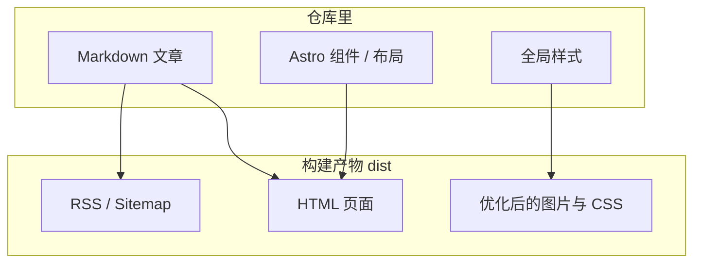

很多人把「源码仓库」和「线上网站」混为一谈。其实推到 GitHub 的是源码；读者访问到的是构建后的静态文件。

## 源码 vs 产物



## 图片也会被处理

正文和封面图会走资源管道：压缩、生成合适尺寸，避免原图直接砸给访客。


## 本地预览构建结果

```bash
npm run build
npm run preview
```

`dev` 看的是开发态；`preview` 更接近上线后的静态文件表现。
