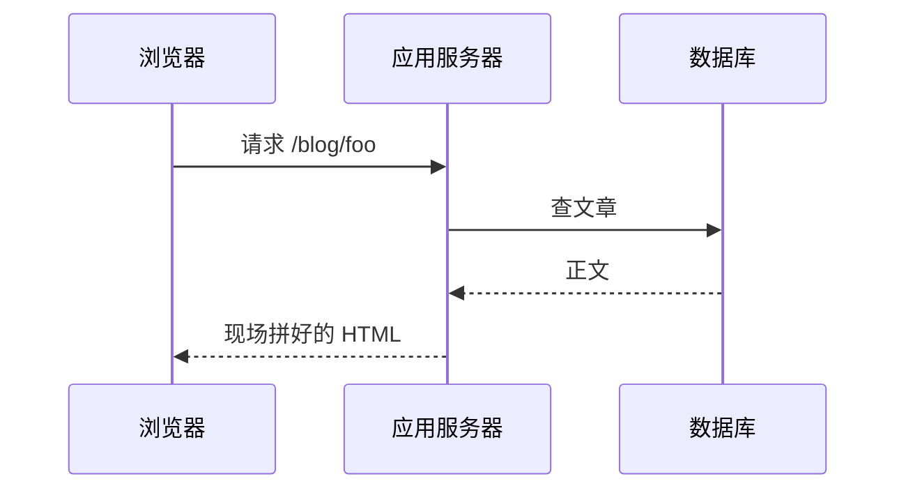
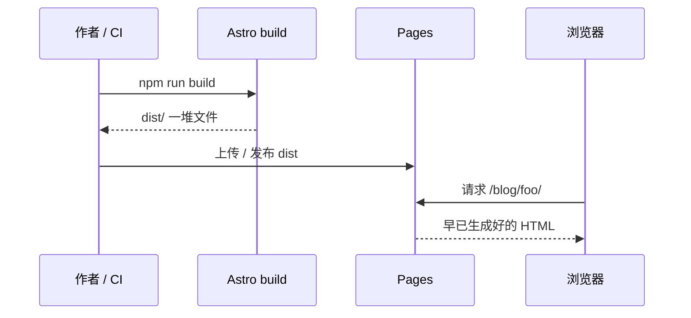
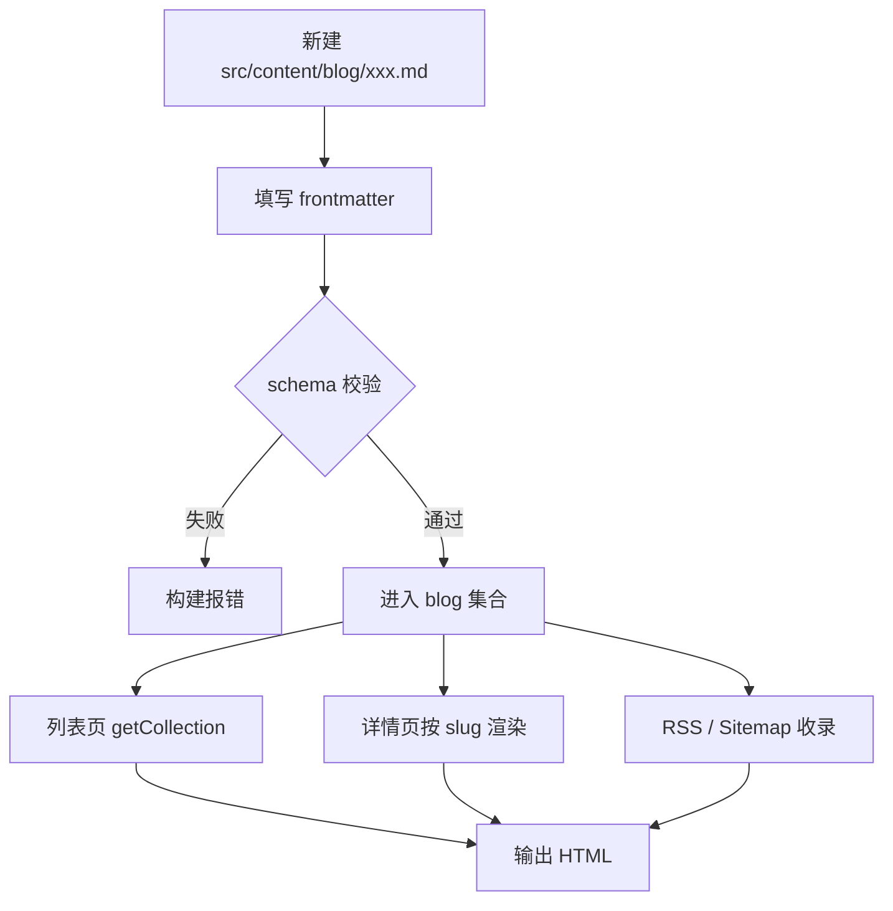
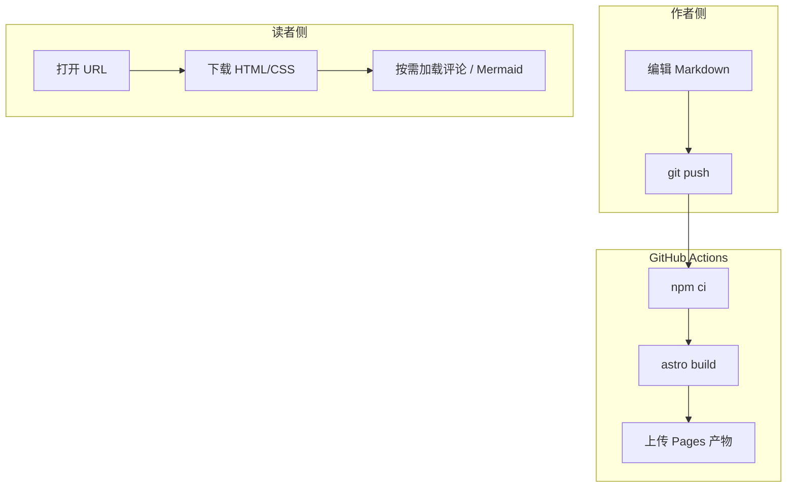
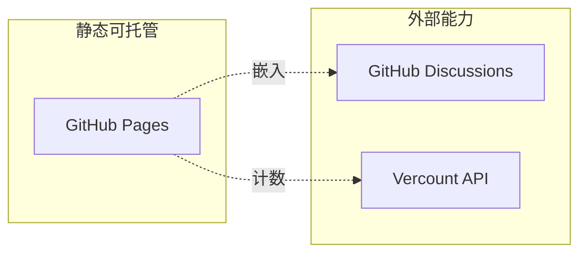
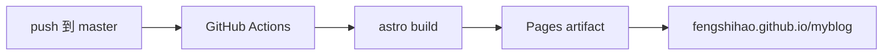

个人博客看起来简单，实际分成三段：**写作**、**构建**、**托管**。搞清楚边界，后面换主题、加评论、加统计都不会慌。

下面用本站（Astro + GitHub Pages）说明技术栈、实现方式，以及背后的原理。文中带有 Mermaid 图——本站支持在 Markdown 里直接写流程图，构建后由浏览器里的 Mermaid 渲染。

## 总览

从作者敲键盘，到读者打开浏览器，数据大致这样流动：


要点只有一句：**内容是仓库里的文件，站点是构建产物，服务器几乎只负责把静态文件发出去。**

## 技术栈一览

| 层级 | 选型 | 作用 |
| --- | --- | --- |
| 框架 | [Astro](https://astro.build) 7 | 静态站点生成（SSG）、路由、组件 |
| 内容 | Markdown / MDX + Content Collections | 写文章、校验 frontmatter |
| 样式 | 手写 CSS（明暗主题、排版） | 少依赖，易改气质 |
| 图示 | Mermaid（客户端） | Markdown 代码块 → 流程图 |
| 评论 | Giscus | 用 GitHub Discussions 当评论后端 |
| 访问量 | Vercount | 静态站上的页面计数 |
| 图片 | Sharp（Astro 资源管道） | 构建期优化图片 |
| 托管 | GitHub Pages + Actions | 推送即构建、发布 |

依赖都在 `package.json` 里：`astro`、`@astrojs/mdx`、`@astrojs/sitemap`、`@astrojs/rss`、`mermaid`、`sharp`。没有运行时数据库，也没有自建 Node 服务——这是刻意的。

## 原理：为什么叫「静态」

### 动态站 vs 静态站

传统动态博客（例如服务端渲染的 CMS）大致是：



每次访问都要跑逻辑、碰存储。灵活，但你要养服务器、关心安全补丁和数据库备份。

静态站把「拼 HTML」提前到 **构建时**：



读者访问时，边缘网络只是在送文件。延迟低、成本低、攻击面小。代价是：**改内容要重新构建**（对本站来说，就是再 push 一次，Actions 自动构建）。

### Astro 在其中做什么

Astro 的默认心智模型很适合博客：

1. **按文件生成路由**：`src/pages/` 下的页面，构建时变成对应 URL。
2. **内容集合**：`src/content/blog/` 里的 Markdown，经 schema 校验后，可在列表页、详情页、RSS 里统一查询。
3. **默认少 JavaScript**：页面主体是 HTML/CSS；只有评论、Mermaid、主题相关交互才在客户端加载脚本。
4. **`base: '/myblog'`**：仓库挂在 `username.github.io/myblog/` 时，所有链接要带此前缀（本站用 `withBase()` 封装）。

文章详情页是动态路由 `src/pages/blog/[...slug].astro`：构建时对每篇文章各生成一份 HTML，而不是运行时按 slug 查库。

## 本仓库里的对应位置

| 环节 | 位置 |
| --- | --- |
| 文章 | `src/content/blog/*.md` |
| 集合与校验 | `src/content.config.ts` |
| 页面与布局 | `src/pages/`、`src/layouts/` |
| 组件（顶栏、评论、翻页） | `src/components/` |
| 全局样式 | `src/styles/global.css` |
| 站点常量 | `src/consts.ts` |
| 部署工作流 | `.github/workflows/deploy.yml` |

本地预览：

```bash
npm install
npm run dev
```

正式构建：

```bash
npm run build
```

产物在 `dist/`。GitHub Actions 在 push 到 `master` / `main` 后执行同样的构建，再发布到 Pages。

## 写一篇文章时发生了什么



frontmatter 最少需要：

```markdown
---
title: '标题'
description: '一句话摘要'
pubDate: 'Sep 18 2026'
---
```

`description` 给列表和 SEO 用；正文开头不必再重复一遍摘要。

本站还接了 Cursor Agent Skill（`.cursor/skills/write-blog-log/`）：草稿可以先润色预览，你确认后再写入仓库并发布——和「内容即文件」是同一套模型，只是把编辑动作交给 AI 辅助。

## Mermaid：图是怎么进文章的

**支持。** 在 Markdown 里写：

````markdown

````

构建后，页面里先是普通的代码块。布局里的 `MermaidInit` 在浏览器中：

1. 找到 `language-mermaid` 代码块  
2. 动态 `import('mermaid')`  
3. 换成 `.mermaid` 容器并 `mermaid.run()`

因此：

- **构建期**仍然是静态 HTML，不依赖编辑器插件；
- **运行期**才拉 Mermaid，避免每页都塞进巨大 JS（只在有图的文章加载）；
- 主题会跟随系统明暗（`dark` / `neutral`）。

再看一张稍完整的「请求与构建」对照：



## 评论与统计：静态站如何「有交互」

静态托管不能自己存评论。本站用 **Giscus**：评论写在仓库的 GitHub Discussions 里，页面里嵌 iframe。对读者是留言框，对你是 Discussions；对 Pages 来说，仍然没有服务器会话。

访问次数用 **Vercount**：浏览器向其 API 打一次 POST，页脚展示本站 / 本页计数。计数在对方服务，站点本身依旧无数据库。



这是静态博客常见的「能力外置」：自己只负责体验与内容，账号体系、存储交给成熟平台。

## 前端体验层（仍可不靠后端）

在纯静态之上，本站还做了几件「像 App」的事：

- **明暗主题**：CSS 变量 + `prefers-color-scheme`，跟系统走。  
- **View Transitions**：文章区切换带动画，顶栏尽量保持静止。  
- **日志抽屉**：点站标打开文章列表，方便跳转。  
- **上一篇 / 下一篇**：构建时按日期算邻居，生成链接。

它们要么是 CSS，要么是少量客户端脚本，**都不需要**你在服务器上跑业务逻辑。

## 部署链路



仓库 **Settings → Pages → Source** 选 GitHub Actions 后，工作流 `.github/workflows/deploy.yml` 会在每次推送时构建并发布。若仓库名不是 `myblog`，记得同步改 `astro.config.mjs` 里的 `base`。

## 一张示意图


> 工具可以换，链路不变：内容是文件，站点是构建结果，服务器只负责把文件发出去。

## 小结

- **技术栈**：Astro 做 SSG，Markdown 做内容，Pages 做托管，Giscus / Vercount / Mermaid 补齐评论、统计与图示。  
- **原理**：把「生成 HTML」挪到构建期，用文件与 CI 代替数据库与常驻进程。  
- **Mermaid**：写在 Markdown 里，客户端渲染；本文的流程图就是例子——往下滚，可以顺便感受长文排版与滚动。

若你想改版式，优先动 `global.css` 与布局组件；文章文件可以多年不动。这正是静态博客省心的地方。
