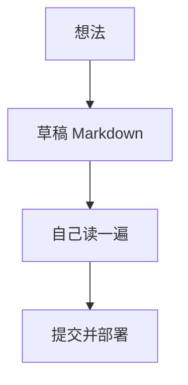

这篇用来对照样式。写新文章时可以复制结构。

## 二级标题

正文保持短句和留白。重点用**加粗**，代码用 `inline code`。

### 三级标题

1. 有序列表第一项  
2. 有序列表第二项  
3. 有序列表第三项

- 无序一点
- 再一点
- 还有一点

## 引用

> 简洁不是少，而是没有多余。  
> —— 写给自己的提醒

## 代码块

```ts
export function greet(name: string) {
  return `你好，${name}`;
}
```

## 表格

| 元素 | 用途 |
| --- | --- |
| 标题 | 层级与扫读 |
| 图片 | 气氛与说明 |
| 流程图 | 讲清过程 |
| 表格 | 对比信息 |

## 流程图



够用就好，不必在一篇里堆满所有花样。
