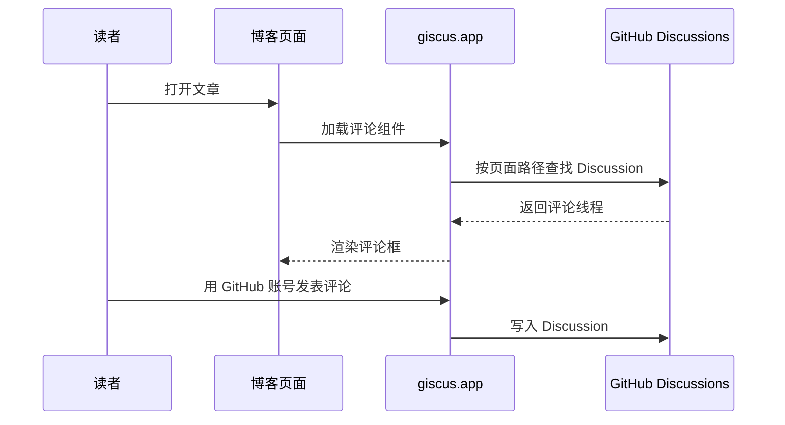

静态托管不能在服务端存评论。Giscus 的做法是：**评论存在 GitHub Discussions，页面只嵌一个前端脚本。**

## 数据流

## 取舍

优点：

- 不用自建数据库
- 登录、反垃圾基本交给 GitHub
- 评论可在仓库 Discussions 里管理

代价：

- 评论者通常需要 GitHub 账号
- 仓库一般要公开
- 依赖第三方前端脚本在线

对本站这种个人技术博客，这个取舍可以接受。
